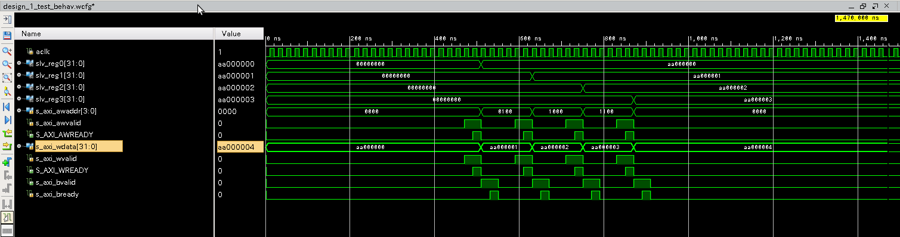

### AXIバスについて
IPを作成するにあたり、AXIバスの知識が避けては通れない。したがって、学んだことをここに記録する。

二つの回路が通信するにあたり、Valid信号とReady信号を用いる。通信元が通信先に「通信準備OKだよ」と知らせるためにValid信号は用いられる。そして、通信先が通信元に「通信準備OKだよ」と知らせるためにReady信号は用いられる。どちらの信号も0がデフォルトで、1にすることで準備が整ったことを伝える。  

通信元と通信先のどちらの準備が整うとき、すなわちValid信号とReady信号がどちらも1となるときに両者の通信ができる。
以下は簡単なサンプル回路を組んでシュミレーションをした結果である。

  

この図から、たしかに ◯◯valid信号と ◯◯ready信号が1のときに通信がなされていることがわかる。

### 参考

http://dora.bk.tsukuba.ac.jp/~takeuchi/?%E9%9B%BB%E6%B0%97%E5%9B%9E%E8%B7%AF%2FHDL%2FVivado%E3%81%A7AXI%E3%83%90%E3%82%B9%E3%82%92%E5%88%A9%E7%94%A8
