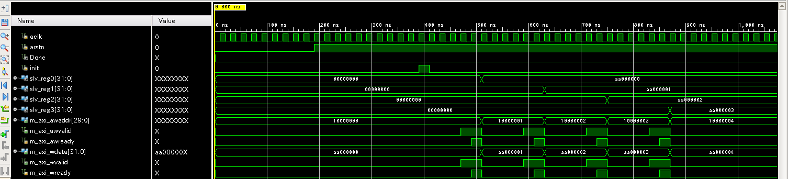

### AXIバスについて
IPを作成するにあたり、AXIバスの知識が避けては通れない。したがって、学んだことをここに記録する。

二つの回路が通信するにあたり、Valid信号とReady信号を用いる。通信元が通信先に「通信準備OKだよ」と知らせるためにValid信号は用いられる。そして、通信先が通信元に「通信準備OKだよ」と知らせるためにReady信号は用いられる。どちらの信号も0がデフォルトで、1にすることで準備が整ったことを伝える。

  
