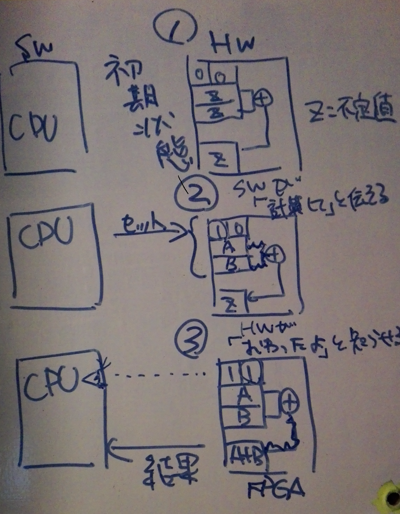

## 開発日記

CPUとFPGAの通信を行うためにValid&Readyレジスタを用いる。Valid&ReadyレジスタはValidビットとReadyビットの2bitからなる。ValidビットはSW側の準備が整ったことをHW側に知らせるともので、オペランド（足し算の引数）の設定が終わるとValidビットを１にする。ReadyビットはHW側の演算完了をSW側に知らせるのもので、和の計算が終了するとReadyビットを1にする。  
全ての処理が終了し、和が求まったときのValidビット、Readyビットはともに1である。
  
処理の流れとValid&Readyレジスタの中身の変化は次のようになる。
1. 初期状態00。
2. SW側からオペランド0（引数）,オペランド1(引数）をセットし、 Validビットを1にする。Valid&Readyレジスタは10となる。
3. Validビットが1になったらHW側が和を計算しrsltレジスタにノンブロッキング代入を行う。終了したらReadyビットを1にする。Valid&Readyレジスタは11となる。  
4. Readyビットが1になったらSW側が結果を受取り、Valid&Readyレジスタを初期状態00に戻す。  
00 -S-> 10 -H-> 11 -S-> 00
 
処理の流れを図にした。  


#### 疑問
- 初期状態によっては01となり得る。実行前にリセットを掛けるべきだろうか。
- 

#### イメージコードHW側
```
reg0(Valid&Readyレジスタ),reg1(オペランド0),reg2(オペランド1),reg3(resultレジスタ)

	wire [3:0] rslt;
	assign rslt = slv_reg1[2:0] + slv_reg2[2:0];
	
    always @(posedge S_AXI_ACLK) begin
      if ( S_AXI_ARESETN == 1'b0 )
        begin
          slv_reg0 <= 0;
          slv_reg1 <= 0;
          slv_reg2 <= 0;
          slv_reg3 <= 0;
        end
      else begin
        if (slv_reg0[0]) begin //if Valid bit is true, start ADD.
            slv_reg3[3:0] <= rslt;
            slv_reg0[1]   <= 1'b1; //Done. Ready bit <= true.      
        end
      end
    end
    assign LED4bit = rslt;
```
#### イメージコードSW側
```
  void polling(base[], a, b):
      int result;
      int val = base[0];
      base[1] = a; /*足し算の引数を与える*/
      base[2] = b;　　/*足し算の引数を与える*/
      val = 0b01; 　　/*HW側に和の計算の実行を指示*/
      while (val == 0b11){
        //loop
      }
      result = base[3];
      val = 0b00;
}
```

### 豆

#### ノンブロッキング代入とブロッキング代入
http://www.altima.jp/column/fpga_edison/13i-blocking.html
always文の中では独立の演算にノンブロッキング代入<=を用いる(なにもないならこっち)。ブロッキング代入は逐次的な演算に用いる

### FPGAにおける同期リセットと非同期リセット
>同期リセットと非同期リセット †
>Xilinx の FPGA では非同期リセットに比べて同期リセットの方が 回路規模に関して有利であるという結果が FPGA の部屋 で得られているそうです。
>
>http://marsee101.web.fc2.com/reset_of_fpga.html
>
>この理由は Xilinx の 「デザイン パフォーマンス向上のためのHDLコーディング法」で詳しく解説されていて、 同期リセット回路は非同期リセット回路に比べてツールによる 最適化が掛かりやすいという話が紹介されています。
http://dora.bk.tsukuba.ac.jp/~takeuchi/?%E9%9B%BB%E6%B0%97%E5%9B%9E%E8%B7%AF%2FHDL%2F%E3%83%AA%E3%82%BB%E3%83%83%E3%83%88%E3%81%AB%E3%81%A4%E3%81%84%E3%81%A6%E3%81%AE%E8%80%83%E5%AF%9F#f67ab6da　より引用


### 変更
- CPUとFPGAの通信状態を記録するレジスタを1bitにして初期状態０、演算状態１とした場合、レジスタが0のときが実行前なのか実行後なのか判別がつかない。  
→　レジスタを2bitにして初期状態と計算終了状態の区別が付くようにした。
